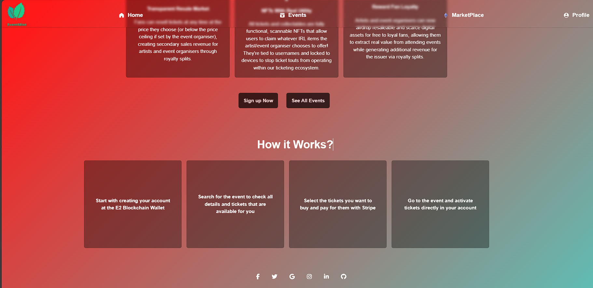
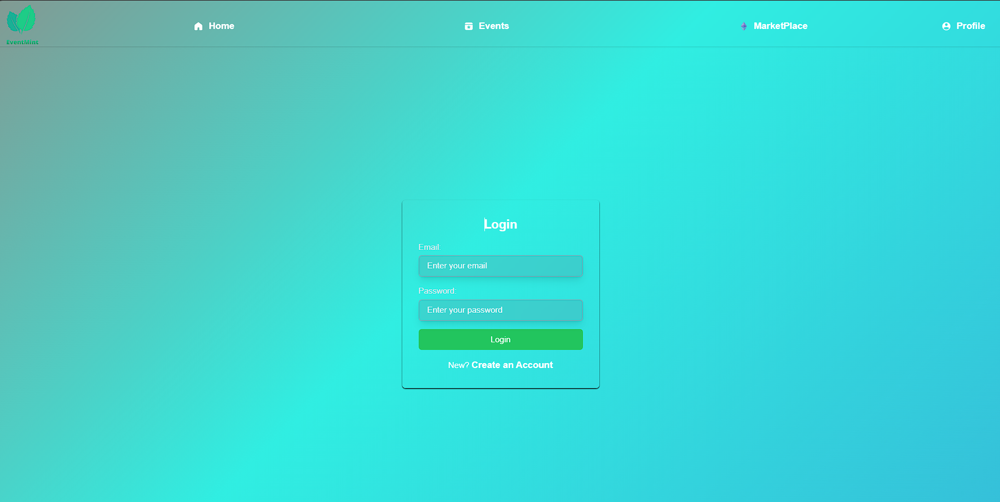
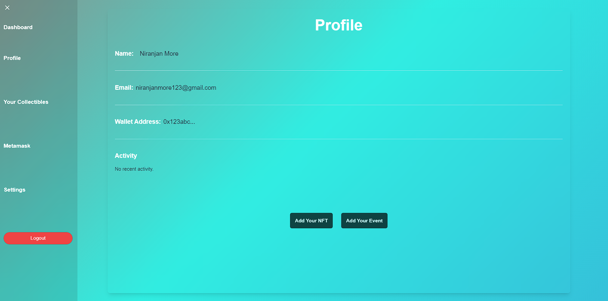

<h1 align="center">
  
   
  EventMint
</h1>

   <strong>EventMint</strong> - Event Booking Platform with Secondary Marketplace 
  CoC Inheritance 2023 || Team Name    
  Add any <a href="https://shields.io/">Shields</a> here

Table of Contents

- [Description](#description)
- [Links](#links)
- [Tech Stack](#tech-stack)
- [Progress](#progress)
- [Future Scope](#future-scope)
- [Applications](#applications)
- [Project Setup](#project-setup)
- [Usage](#usage)
- [Team Members](#team-members)
- [Mentors](#mentors)
- [Screenshots](#screenshots)

## 📝Description

EventMint is a modern platform transforming event management and ticketing. Its user-friendly interface simplifies the discovery, booking, and organization of various events, from concerts to conferences. Whether you're planning or attending, EventMint offers seamless ticketing solutions and robust event management tools.

Additionally, EventMint features a unique secondary marketplace where users securely buy and sell event tickets, as well as NFTs related to events. This marketplace fosters a dynamic, community-driven ecosystem, facilitating easy access to tickets for sold-out events or hassle-free ticket exchanges.

Moreover, EventMint leverages blockchain technology to empower users in managing their event experiences. Through blockchain integration, EventMint provides a secure platform for buying, selling, and exchanging event tickets and NFTs, ensuring transparency and trust within the community.

The inclusion of event-related NFTs adds a unique dimension to the platform, offering users the opportunity to collect digital assets associated with their favorite events. These NFTs can serve as digital memorabilia or collectibles, further enhancing the overall event experience and providing additional monetization opportunities for organizers and the platform.

This innovative approach enhances accessibility and flexibility for both event organizers and attendees, making EventMint the ultimate destination for modern event experiences

1. User-friendly Interface: Intuitive design for easy 2. navigation.
2. Diverse Event Options: Wide range of event categories available.
3. Seamless Ticketing Solutions: Effortless ticket purchasing process.
4. Secondary Marketplace: Secure platform for buying and selling tickets.
5. NFT Marketplace: Allows users to buy and sell event-related NFTs.
6. Blockchain Integration: Ensures transparency and security.
7. Location Mapping: Enables users to easily locate event venues and nearby amenities on a map interface.

## 🔗Links

- [GitHub Repository](https://github.com/NiranjanMore10/EventMint.git)
- [Demo Video](https://drive.google.com/drive/folders/1J2MQuSqYkXvjSrx8hJ4zXfokUBKaHRbp?usp=sharing)
- [Drive Link to Screenshots of your project](https://drive.google.com/drive/folders/1kzhaGKkNnI3-ZYZS5kK0h2h7TiHndFuN?usp=sharing)
- [Hosted Website Link](Yet to Host)
- [Hosted Backend Link](Yet to Host)

Add any more links/resources you used for your project

## 🤖Tech-Stack

Mention all languages/libraries/frameworks used in your project **domain-wise**  
You can use icons too - find them [here](https://github.com/get-icon/geticon)

#### Front-end

- Html
- CSS
- JavaScript
- React JS
- Tailwind CSS
- LeafLet library for map
- opencage for reverse geo
- Most of React libraries

#### Back-end

- NodeJS
- ExpressJS

#### Database

- MongoDB
- Mongoose

#### Blockchain

- Solidity

## 📈Progress

List down all the fully implemented features in your project

- [x] User Authentication
- [x] Interactive User interface
- [x] Events
- [x] Profile

List down all the partially implemented features in your project

- [ ] Map feature
- [ ] Search Functionability
- [ ] NFT Marketplace

## 🔮Future Scope

List down all the future plans for the project here

- We will try to make the make the map feature more responsive and interactive. We rignt now have a few specified location of the Mumbai city in the map. we will try to increase the number of locations.
- Making the site more Simple for organisers
- We will add normal payment options aswell

## 💸Applications

Event organizers often face challenges in efficiently managing and promoting their events. EventMint provides robust event management tools, including ticketing solutions and promotional features, to streamline the planning and execution process.

EventMint offers monetization opportunities for both event organizers and the platform itself. Organizers can leverage the platform to promote their events, sell tickets, and even generate additional revenue by offering event-related NFTs. Meanwhile, EventMint can monetize its services through transaction fees, premium features, and partnerships with event sponsors or vendors.

The inclusion of event-related NFTs adds a unique dimension to the platform, offering users the opportunity to collect digital assets associated with their favorite events. These NFTs can serve as digital memorabilia or collectibles, further enhancing the overall event experience and providing additional monetization opportunities for organizers and the platform.

## 🛠Project Setup

The user willl first clone the repo in his pc.
after that he will switch to backend branch (the name of branch may change) and will install all dependencies by typing "npm i"
the user can then switch to client directory and type npm start
and then switch to server directory and type npm run dev.

## 💻Usage

Access the Website : Visit the EventMint website
Create an Account : If you're a new user, you may need to create an account by providing basic information such as your name, email address, and password. Some features may require you to log in to access them.
View Event Details: Click on an event to view detailed information including event description, date, time, location, ticket prices, and availability.
Explore Secondary Marketplace : If the platform includes a secondary marketplace for buying and selling event tickets or NFTs, you can explore this feature to find tickets for sold-out events or trade spare tickets with other users.

## 👨‍💻Team Members

Add names of your team members with their emails and links to their GitHub accounts

- [Dhruv Desai](https://github.com/dhruuvd-1704): dhruuvd@gmail.com
- [Ayush Mhetre](https://github.com/Volentry): ayushmhetre1234@gmail.com
- [Niranjan More](https://github.com/NiranjanMore10): niranjanmore7887@gmail.com
- [PushkarSanap](https://github.com/): ayushmhetre1234@gmail.com

## 👨‍🏫Mentors

Add names of your mentors with their emails and links to their GitHub accounts

- [Adwait M.](https://github.com/):adwaitmandge@gmail.com
- [SiddeshSingh T.](https://github.com/): smtanwar_b21@ce.vjti.ac.in

## 📱Screenshots

Add a few screenshots for parts of the project completed till now to give the viewer a quick idea of what your project looks like. After all, a picture speaks a thousand words.

You'll have to link the screenshots from your drive folder here.

Use this template as a guide for writing your documentation. Feel free to customize and adapt it for you project.  
For more Markdown syntax help, visit [here](https://www.markdownguide.org/basic-syntax/)
